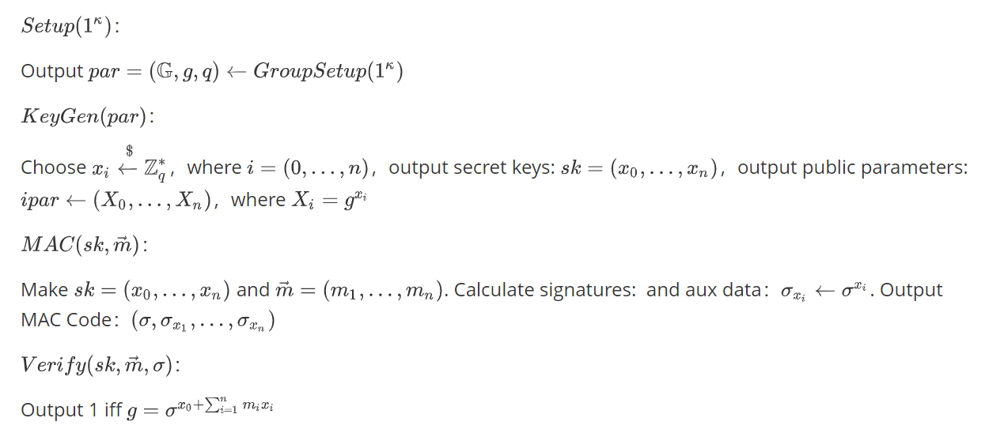

# Algebraic MAC：$MAC_{wBB}$

## Img

## Origin

$Setup(1^{\kappa})$：

Output $par=(\mathbb{G},g,q) \xleftarrow{} GroupSetup(1^{\kappa})$

$KeyGen(par)$：

Choose $x_i \xleftarrow{$} \mathbb{Z}_q^*$，where $i=(0,...,n)$，output secret keys: $sk=(x_0,...,x_n)$，output public parameters:$ipar \xleftarrow{} (X_0,...,X_n)$，where $X_i = g^{x_i}$

$MAC(sk,\vec{m})$：

Make $sk=(x_0,...,x_n)$ and $\vec{m} = (m_1,...,m_n)$. Calculate signatures:  and aux data：$\sigma_{x_i} \gets \sigma^{x_i}$. Output MAC Code：$(\sigma,\sigma_{x_1},...,\sigma_{x_n})$

$Verify(sk,\vec{m},\sigma)$：

Output 1 iff $g=\sigma^{x_0 + \sum_{i=1}^{n} m_i x_i}$

# References

Camenisch J, Drijvers M, Dzurenda P, et al. Fast keyed-verification anonymous credentials on standard smart cards[C]//IFIP International Conference on ICT Systems Security and Privacy Protection. Springer, Cham, 2019: 286-298.