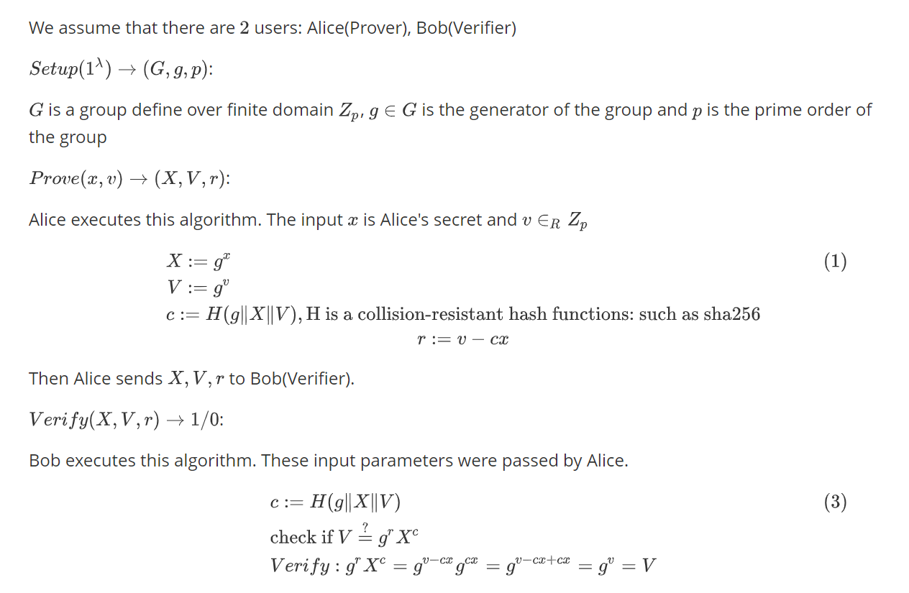

# Schnorr Non-interactive Zero-Knowledge Proof

## Img

## Origin

We assume that there are $2$ users: Alice(Prover), Bob(Verifier)

$Setup(1^{\lambda}) \rightarrow{} (G,g,p)$:

$G$ is a group define over finite domain $Z_p $, $g \in G$ is the generator of the group and $p$ is the prime order of the group

$Prove(x,v) \rightarrow{} (X,V,r)$:

Alice executes this algorithm. The input $x$ is Alice's secret and $v \in_R Z_p$
$$
X := g^{x} \\
V := g^{v} \\
c := H(g \| X \| V), \text{H is a collision-resistant hash functions: such as sha256} \\
r := v - cx
$$
Then Alice sends $X,V,r$ to Bob(Verifier).

$Verify(X,V,r) \rightarrow{} 1/0$:

Bob executes this algorithm. These input parameters were passed by Alice. 
$$
c := H(g \| X \| V) \\
\text{check if } V \overset{?}{=} g^r X^c \\
Verify: g^r X^c = g^{v-cx} g^{cx} = g^{v -cx +cx} = g^v = V
$$

# References

https://tools.ietf.org/html/rfc8235