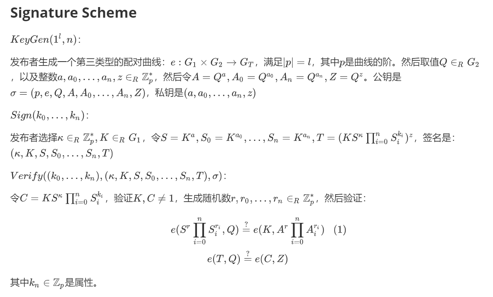

# An efficient self-blindable attribute-based credential scheme

## Img

## Origin

### Signature Scheme

$KeyGen(1^{l },n)$：

发布者生成一个第三类型的配对曲线：$e : G_1 \times G_2 \rightarrow{} G_T$，满足$|p| = l$，其中$p$是曲线的阶。然后取值$Q \in_R G_2$，以及整数$a,a_0,...,a_n,z \in_R \mathbb{Z}_p^*$，然后令$A=Q^a,A_0 = Q^{a_0},A_n = Q^{a_n},Z=Q^z$。公钥是$\sigma=(p,e,Q,A,A_0,...,A_n,Z)$，私钥是$(a,a_0,...,a_n,z)$

$Sign(k_0,...,k_n)$：

发布者选择$\kappa \in_R \mathbb{Z}_p^*,K \in_R G_1$，令$S = K^a,S_0 = K^{a_0},...,S_n = K^{a_n},T=(K S^{\kappa} \prod_{i=0}^n S_i^{k_i})^z$，签名是：$(\kappa,K,S,S_0,...,S_n,T)$

$Verify((k_0,...,k_n),(\kappa,K,S,S_0,...,S_n,T),\sigma)$：

令$C = K S^{\kappa} \prod_{i=0}^n S_i^{k_i}$，验证$K,C \neq 1$，生成随机数$r,r_0,...,r_n \in_R \mathbb{Z}_p^*$，然后验证：
$$
e(S^r \prod_{i=0}^n S_i^{r_i},Q) \overset{?}{=} e(K,A^r \prod_{i=0}^n A_i^{r_i})  \\
e(T,Q) \overset{?}{=} e(C,Z)
$$

其中$k_n \in \mathbb{Z}_p$是属性。

### Credential Scheme

$Issue$：

Common inofrmation between User and Issuer:

Attributes：$k_1,...,k_n$，issuer's public key：$\sigma = (p,e,Q,A,A_0,...,A_n,Z)$

Issuer:

public $\bar{S} = \bar{K}^a,\bar{S_0} = \bar{K}^{a_0}$ where $\bar{K} \in_R G_1$

User:
$$
choose \ \alpha,\kappa' \in_R \mathbb{Z}_p^* \\
set \ S = \bar{S}^{\alpha},S_0 = \bar{S_0}^{\alpha} \\
SPK\{(\kappa',k_0): R=S^{\kappa'} S_0^{k_0} \} \\
sends \ S,S_0,R=S^{\kappa'} S_0^{k_0} \text{ to issuer}
$$
Issuer:
$$
set \ K = S^{1/a} \\
verify \ S \neq \bar{S},K = S_0^{1/a_0} \\
choose \ \kappa'' \in_R \mathbb{Z}_p \\
set \ S_i = K^{a_i},\forall i \in[1,n] \\
set \ T = (K S^{\kappa''} R \prod_{i=1}^n S_i^{k_i})^z \\
sends \ \kappa'',K,S_1,...,S_n,T \text{ to user}
$$
User:
$$
set \ \kappa = \kappa' + \kappa'' \\
return \ (k_0,...,k_n),(\kappa,K,S,S_0,...,S_n,T)
$$
$ShowCredential$:

Common inofrmation between User and Verifier:

Issuer's public key $\sigma = (p,e,Q,A,A_0,...,A_n,Z)$, disclosure set $\mathcal{D}$, undisclosed set $\mathcal{C} = \{1,...,n \} \setminus \mathcal{D}$, disclosed attributes: $(k_i)_{i \in D}$

User:
$$
knows \ K,S,S_0,...,S_n,\kappa,(k_i)_{i \in \mathcal{C}},C,T \\
choose \ \alpha,\beta \in_R \mathbb{Z}_p^* \\
set \ \tilde{C} = C^{- \alpha/\beta}, \tilde{T} = T^{- \alpha/\beta} \\
set \ D = \bar{K}^{-1} \prod_{i \in D} \bar{S_i}^{-k_i} \\
SPK\{(\beta,\kappa,k_0,k_i)_{i \in \mathcal{C}}: D = \tilde{C}^{\beta} \bar{S}^{\kappa} \bar{S_0}^{k_0} \prod_{i \in \mathcal{C}} \bar{S_i}^{k_i} \} \\
sends \ \bar{K},\bar{S},(\bar{S_i})_{i=0,...,n},\tilde{C},\tilde{T} \text{ to Verifier}
$$
$Verify$:

Verifier:
$$
Verify \ ZK \ Proof \\
choose \ r,r_0,...,r_n \in_R \mathbb{Z}_p^* \\
verify \ e(\tilde{C},Z) \overset{?}{=} e(\tilde{T},Q) \\
and \ e(\bar{S}^r \prod_{i=0}^n \bar{S_i}^{r_i},Q) \overset{?}{=} e(\bar{K},A^r \prod_{i=0}^n A_i^{r_i})
$$

# References

Ringers S, Verheul E, Hoepman J H. An efficient self-blindable attribute-based credential scheme[C]//International Conference on Financial Cryptography and Data Security. Springer, Cham, 2017: 3-20.

