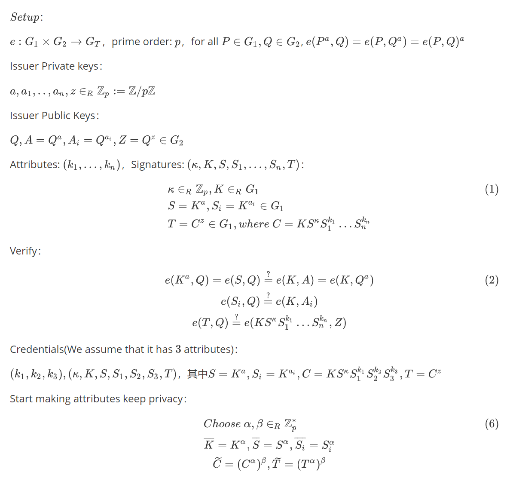
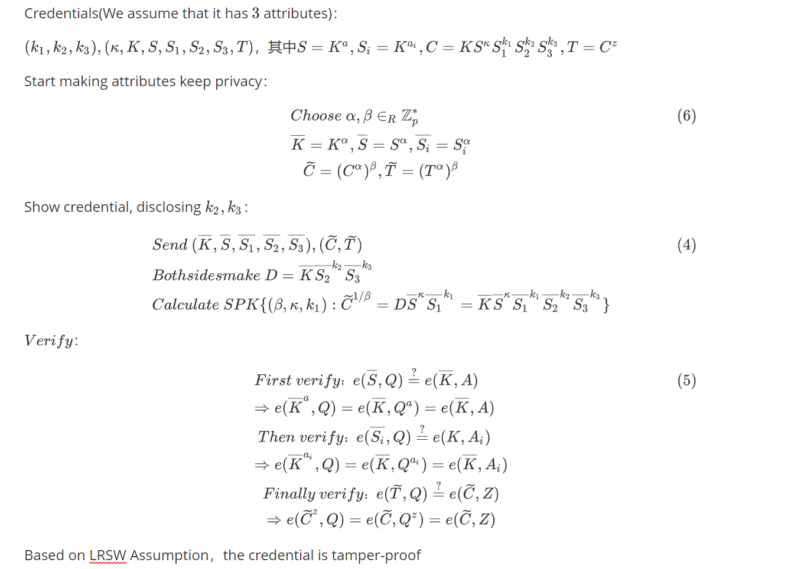

# An efficient self-blindable attribute-based credential scheme

## Img

## Origin

$Setup$：

$e:G_1 \times G_2 \rightarrow{} G_T$，prime order: $p$，for all $P \in G_1, Q \in G_2$, $e(P^a,Q) = e(P,Q^a) = e(P,Q)^a$

Issuer Private keys：

$a,a_1,..,a_n,z \in_{R} \mathbb{Z}_p := \mathbb{Z}/p\mathbb{Z}$

Issuer Public Keys：

$Q,A = Q^a,A_i = Q^{a_i},Z = Q^z \in G_2$

Attributes: $(k_1,...,k_n)$，Signatures: $(\kappa,K,S,S_1,...,S_n,T)$：
$$
\kappa \in_R \mathbb{Z}_p , K \in_R G_1 \\
S = K^a, S_i = K^{a_i} \in G_1 \\
T = C^{z} \in G_1,where \ C=KS^{\kappa}S_1^{k_1} \dots S_n^{k_n}
$$
Verify：
$$
e(K^a,Q) = e(S,Q) \overset{?}{=} e(K,A) = e(K,Q^a) \\
e(S_i,Q) \overset{?}{=} e(K,A_i) \\
e(T,Q) \overset{?}{=} e(KS^{\kappa} S_1^{k_1} \dots S_n^{k_n},Z)
$$

Credentials(We assume that it has $3$ attributes)：

$(k_1,k_2,k_3),(\kappa,K,S,S_1,S_2,S_3,T)$，其中$S = K^a,S_i = K^{a_i}, C = KS^{\kappa}S_1^{k_1} S_2^{k_2} S_3^{k_3},T=C^z$

Start making attributes keep privacy：
$$
Choose \ \alpha,\beta \in_R \mathbb{Z}_p^* \\
\overline{K} = K^{\alpha}, \overline{S} = S^{\alpha},\overline{S_i} = S_i^{\alpha} \\
\widetilde{C} = (C^{\alpha})^{\beta}, \widetilde{T} = (T^{\alpha})^{\beta}
$$
Show credential, disclosing $k_2,k_3$：
$$
Send \ (\overline{K},\overline{S},\overline{S_1},\overline{S_2},\overline{S_3}),(\widetilde{C},\widetilde{T}) \\
Both sides make \ D = \overline{K} \overline{S_2}^{k_2} \overline{S_3}^{k_3} \\
Calculate \ SPK\{(\beta,\kappa,k_1): \widetilde{C}^{1/\beta} = D \overline{S}^{\kappa} \overline{S_1}^{k_1} = \overline{K} \overline{S}^{\kappa} \overline{S_1}^{k_1} \overline{S_2}^{k_2} \overline{S_3}^{k_3} \}
$$
$Verify$：
$$
First \ verify ：e(\overline{S},Q) \overset{?}{=} e(\overline{K},A) \\
 \Rightarrow{} e(\overline{K}^a,Q) = e(\overline{K},Q^a) = e(\overline{K},A) \\
 Then \ verify：e(\overline{S_i},Q) \overset{?}{=} e(K,A_i) \\
 \Rightarrow{} e(\overline{K}^{a_i},Q) = e(\overline{K},Q^{a_i}) = e(\overline{K},A_i) \\
 Finally \ verify：e(\widetilde{T},Q) \overset{?}{=} e(\widetilde{C},Z) \\
 \Rightarrow{} e(\widetilde{C}^z,Q) = e(\widetilde{C},Q^z) = e(\widetilde{C},Z)
$$
Based on LRSW Assumption，the credential is tamper-proof

# References

Ringers S, Verheul E, Hoepman J H. An efficient self-blindable attribute-based credential scheme[C]//International Conference on Financial Cryptography and Data Security. Springer, Cham, 2017: 3-20.